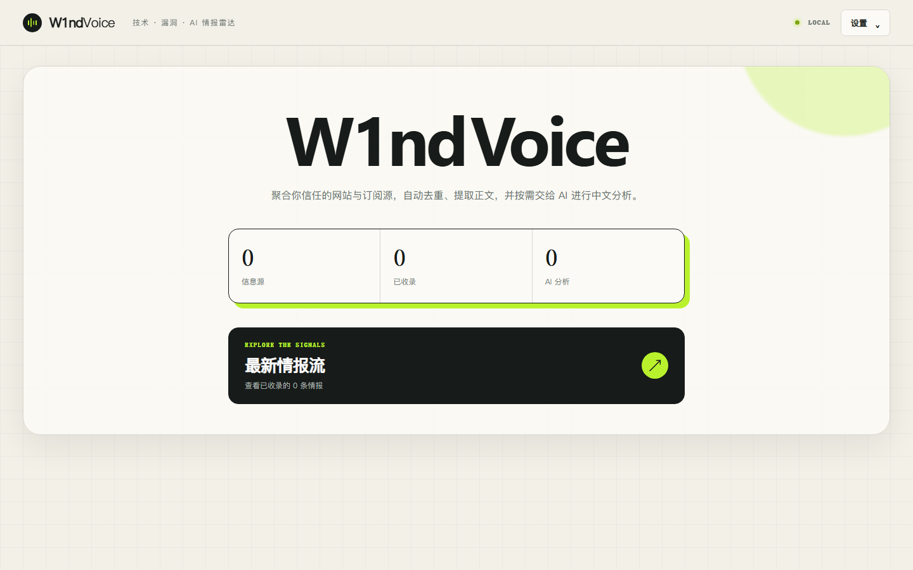

# W1ndVoice

W1ndVoice 是一个轻量、自托管的技术与安全情报雷达。它可以定时采集 RSS/Atom、JSON API / JSON Feed、带 RSS 自动发现的站点，以及普通网页；内容会存入本机 SQLite，AI 分析则由用户自行配置的 OpenAI-compatible 接口按需执行。



## 当前能力

- 在网页界面添加、编辑、删除和立即刷新信息源，并显示可点击的原始 URL
- 支持 RSS/Atom、JSON API / JSON Feed、网页 RSS 自动发现、普通网页链接发现
- 普通网页可填写 CSS 选择器，精确指定文章列表元素
- 自动提取文章正文、规范化 URL、按 URL 与内容哈希去重
- 每个信息源独立设置抓取间隔（按小时，最低 1 小时）
- 可将单个信息源设为“永不自动抓取”，同时保留手动抓取能力
- 普通网页可分别设置主页最大抓取页数（默认 5，范围 1–100）
- 填写网址后可一键“添加并立即抓取”，已有信息源也可随时立即抓取
- 手动或自动进行 AI 中文摘要、重要度、关键词和漏洞风险分析
- 支持 OpenAI、OpenRouter、兼容网关和本地 OpenAI-compatible 服务
- 模型与 API Key 全局复用，每个信息源可使用独立分析提示词
- API Key 使用本机生成的 Fernet 密钥加密存储
- 阻止爬虫访问本机、内网、链路本地和保留地址，重定向也会重新校验
- SQLite WAL、响应体 5 MiB 上限、单源并发锁
- Dockerfile 与 Compose 部署文件

## 快速开始

需要 Python 3.11 或更高版本。

```powershell
cd <项目目录>
uv sync --extra dev
uv run w1ndvoice
```

打开 <http://127.0.0.1:8000>。

也可以使用传统虚拟环境：

```powershell
python -m venv .venv
.venv\Scripts\Activate.ps1
pip install -e ".[dev]"
w1ndvoice
```

Docker：

```bash
docker compose up --build -d
```

数据默认保存在 `data/`。可以复制 `.env.example` 中的变量，按需设置启动地址、端口、数据目录和日志级别。

## Windows EXE

在 Windows 上执行 `.\scripts\build-exe.ps1`，生成 `dist/W1ndVoice.exe`。双击 EXE 后会打开独立的 W1ndVoice 应用窗口，不会弹出终端或自动打开浏览器；关闭应用窗口即可停止本地服务。应用窗口依赖 Microsoft Edge WebView2 Runtime。若 8000 端口已被占用，可在“设置 → 端口设置”保存其他端口，关闭并重新打开应用后生效；`W1NDVOICE_PORT` 环境变量优先于界面设置。端口被占用而无法启动时，可临时设置此环境变量再启动。

EXE 不包含当前用户的订阅、文章、API Key 或加密密钥。便携版首次运行会在 EXE 所在目录创建 `w1ndvoice.db`、`secret.key` 和日志文件，因此应将 EXE 放在可写的私人目录，不要直接从只读目录运行；源码版仍使用项目下的 `data/`。移动个人数据时必须同时移动 `w1ndvoice.db` 与 `secret.key`，不要将它们加入公开发布文件。

## 上传 GitHub 前

项目的 `.gitignore` 排除了 `data/`、环境变量文件、日志、数据库、密钥、构建目录和 `dist/`。发布源码时只提交代码、示例配置和文档；公开版 EXE 放在 `dist/public/W1ndVoice.exe`，适合作为 GitHub Release 附件单独上传，不要附带个人数据目录。`docs/dashboard.png` 是空白数据实例的截图。

`.gitignore` 只阻止尚未被 Git 跟踪的文件。提交前检查 `git status` 和 `git diff --cached --name-only`，并检查文档截图、日志和历史提交是否含有个人订阅网址或密钥；若密钥已经公开，需在 API 提供商处撤销并更换。

首次上传时，在 GitHub 网页创建一个名为 `W1ndVoice` 的空仓库，不要勾选自动生成 README、`.gitignore` 或许可证。然后在本项目根目录的 PowerShell 中执行：

```powershell
git init -b main
git add .gitignore .env.example README.md pyproject.toml uv.lock Dockerfile compose.yaml app scripts tests docs/dashboard.png
git diff --cached --name-only
git commit -m "Initial W1ndVoice"
git remote add origin "https://github.com/YOUR_NAME/W1ndVoice.git"
git push -u origin main
```

将 `YOUR_NAME` 换成你的 GitHub 用户名。`git diff --cached --name-only` 应只列出源码和文档；如果出现 `data/`、密钥、数据库、日志或 EXE，先停止提交并核对忽略规则。上传 EXE 时在 GitHub 仓库的 Releases 页面新建版本，将 `dist/public/W1ndVoice.exe` 作为附件上传；不要使用 `git add -f` 把 EXE 或私人数据加入源码仓库。

## 添加信息源

### RSS / Atom

直接填写订阅地址，类型选“RSS / Atom”或“自动识别”。RSS 条目正文不完整时，W1ndVoice 会继续访问文章链接并提取正文。

### JSON API / JSON Feed

填写返回 JSON 的公开 GET 地址，类型选“JSON API / JSON Feed”或“自动识别”。例如 GitHub 已审核安全公告：

```text
https://api.github.com/advisories?type=reviewed&sort=published&direction=desc&per_page=100
```

支持顶层数组、JSON Feed 的 `items` 数组，以及 `results`、`data`、`advisories`、`articles` 包裹的数组（`data` 还可再包一层）。条目需有标题和文章链接；常见字段如 `title` / `summary`、`html_url` / `url`、`description` / `content_text` / `content_html`、`published_at` / `date_published` 会自动映射。每次最多读取前 100 条。接口须可匿名访问，当前不支持自定义请求头、分页和自定义字段映射。

### 有 RSS 自动发现的网页

填写网站首页或新闻页并选择“自动识别”。页面包含标准 `<link rel="alternate">` 时会自动找到订阅源。

### 没有 RSS 的普通网页

选择“普通网页”。不填 CSS 选择器时，W1ndVoice 会根据同域链接、链接文字和 URL 结构寻找可能的文章；网站结构特殊时，建议填写文章卡片的 CSS 选择器，例如：

```css
article.news-card
```

系统会从每个匹配元素内寻找链接。动态渲染、登录后可见、Cloudflare 挑战或强反爬页面暂不支持。

## AI 设置

W1ndVoice 使用 `/chat/completions` 接口。填写：

- Base URL，例如 `https://api.openai.com/v1`
- 模型名称
- API Key

分析提示词在新增或编辑信息源时分别配置。留空时使用内置默认规则；修改后，后续手动分析与自动分析都会使用该信息源的新规则。

API Key 不会在设置读取接口或 HTML 中返回。数据库文件 `w1ndvoice.db` 与密钥文件 `secret.key` 必须一起备份：源码运行时二者在 `data/`，EXE 运行时二者在 EXE 所在目录。丢失密钥文件后，已保存的 API Key 无法解密。

考虑到 API 成本，新增信息源时“自动 AI 分析”默认关闭。启用后，每个信息源每轮最多自动分析 5 条新内容；其余文章仍可在情报流中手动分析。

## 架构

```text
用户配置 URL
     │
     ▼
安全 URL 校验 ──► RSS / Atom 或 JSON 解析
     │                  │
     └──────────► 网页发现 + 正文提取
                        │
                        ▼
              URL/内容哈希去重
                        │
                        ▼
                    SQLite
                   ╱       ╲
             FastAPI UI    AI 分析
```

后端调度器会周期性检查已经到达小时级间隔的信息源。抓取、存储、AI 分析是分开的步骤，AI 不可用时不会影响基础订阅与阅读。

## 开发与验证

```powershell
uv run pytest -q
uv run ruff check .
```

健康检查：`GET /health`。交互式接口文档：`/docs`。

## 设计参考

实现为独立代码，没有复制第三方仓库源码。管线设计参考了以下 MIT 项目的公开架构：

- [Pharos](https://github.com/nullvaluefound/pharos)：采集、SQLite 存储与 LLM 富化分层
- [CondenseIt](https://github.com/wildlifechorus/condenseit)：多来源收集与 OpenAI-compatible 配置
- [rss-ai-news-py](https://github.com/Develata/rss-ai-news-py)：板块化 RSS 与可定制提示词

## 使用边界

只添加你有权访问和自动采集的网站，并遵守网站服务条款、robots 规则与当地法律。W1ndVoice 不绕过登录、付费墙、验证码或反爬机制。
